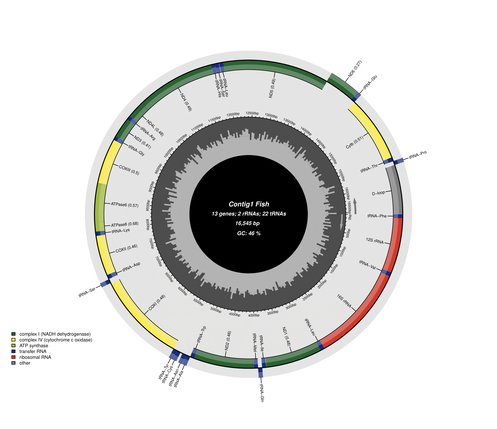

#  _Mesonauta festivus_ - mtDNA




> Projeto de montagem e análise do DNA mitocondrial do peixe _Mesonauta Festivus_.

### Ajustes e melhorias

O projeto ainda está em desenvolvimento e as próximas atualizações serão voltadas nas seguintes tarefas:

- [x] Montagem
- [x] Anotação
- [x] tRNA scan
- [x] RCSU
- [] Regiões secundárias D-loop
- [x] Árvore filogenética

## 💻 Softwares utilizados

- NOVOPlasty
- Mitoz
- tRNAscan-SE
- BLASTn
- Mitoannotator
- Nextflow
- Phylotree

## 🚀 Metodologia


Para a moontagem do mtDNA tilizamos as reads de acesso [ERX10239209](https://www.ncbi.nlm.nih.gov/sra/ERX10239209)
Como seed do NOVOPlasty utilizamos o mtDNA de acesso [NC_033550.1](https://www.ncbi.nlm.nih.gov/nuccore/NC_033550.1/)

A parte de montagem, anotação e tRNAs está automatizada em um pipline em desenvolvimento em nextflow:
[mitomine - NextFlow](https://github.com/gleisonm/mitomine.git)

### Montagem:

NOVOPlasty
```
Project:
-----------------------
Project name          = ${prefix}_${run}
Type                  = mito
Genome Range          = 13000-18000
K-mer                 = 33
Max memory            = 120
Extended log          = 0
Save assembled reads  = no
Seed Input            = $seed
Extend seed directly  = no
Reference sequence    =
Variance detection    =
Chloroplast sequence  =

Dataset 1:
-----------------------
Read Length           = 151
Insert size           = 525
Platform              = illumina
Single/Paired         = PE
Combined reads        =
Forward reads         = /data/home/gleison.azevedo/ciclideos/data/raw/${reads[0]}
Reverse reads         = /data/home/gleison.azevedo/ciclideos/data/raw/${reads[1]}
Store Hash            =

Heteroplasmy:
-----------------------
MAF                   =
HP exclude list       =
PCR-free              =

Optional:
-----------------------
Insert size auto      = yes
Use Quality Scores    = no
Reduce ambigious N's  =
Output path           =
```
> Este processo é repetido utilizando o output como seed para afim de polir a montagem
```
Project:
-----------------------
Project name          = ${prefix}_polish
Type                  = mito
Genome Range          = 13000-18000
K-mer                 = 33
Max memory            = 120
Extended log          = 0
Save assembled reads  = no
Seed Input            = $seed
Extend seed directly  = no
Reference sequence    =
Variance detection    =
Chloroplast sequence  =

Dataset 1:
-----------------------
Read Length           = 151
Insert size           = 525
Platform              = illumina
Single/Paired         = PE
Combined reads        =
Forward reads         = /data/home/gleison.azevedo/ciclideos/data/raw/$fastq1
Reverse reads         = /data/home/gleison.azevedo/ciclideos/data/raw/$fastq2
Store Hash            =

Heteroplasmy:
-----------------------
MAF                   =
HP exclude list       =
PCR-free              =

Optional:
-----------------------
Insert size auto      = yes
Use Quality Scores    = no
Reduce ambigious N's  =
Output path           =
```
c

Mitoz
```
fastq1=/storages/acari/gleison.azevedo/ciclideos/data/raw/ERR10789898_Illumina_NovaSeq_6000_paired_end_sequencing_1.fastq.gz
fastq2=/storages/acari/gleison.azevedo/ciclideos/data/raw/ERR10789898_Illumina_NovaSeq_6000_paired_end_sequencing_2.fastq.gz

mitoz all  \
--outprefix Mfestivus_ERR10789898 \
--thread_number 8 \
--clade Chordata \
--genetic_code 2 \
--species_name "Mesonauta festivus" \
--fq1 $fastq1 \
--fq2 $fastq2 \
--fastq_read_length 151 \
--data_size_for_mt_assembly 3,0 \
--assembler megahit \
--kmers_megahit 59 79 99 119 141 \
--memory 80 \
--requiring_taxa Chordata
```
> Outputs:
[MitoZ ASSEMBLY](Mfestivus_ERR10789898.megahit.result)
[MitoZ ANOTAÇÃO](Mfestivus_ERR10789898.Mfestivus_ERR10789898.megahit.mitogenome.fa.result)

As mitocondrias foram alinhadas utilizando BLAST e obtiveram .....

### Anotação:

As mitocôndrias foram anotadas no [MitoAnnotator](http://mitofish.aori.u-tokyo.ac.jp/annotation/input/)
> Outputs:
[MitoAnnotator output](mitoAnnotator_output)

### tRNAscan:

Os tRNAs foram obtidos pelo mitoz e plotados pelo programa [tRNAscan-SE](http://lowelab.ucsc.edu/tRNAscan-SE/)

#### Outputs:


```

Sequence                                		tRNA	Bounds	tRNA	Anti	Intron Bounds	Inf	      
Name                                    	tRNA #	Begin	End	Type	Codon	Begin	End	Score	Note
--------                                	------	-----	------	----	-----	-----	----	------	------
k141_742411_trnK_uuu__len_75__308_383_- 	1	1 	75	Lys	TTT	0	0	109.1	
k141_742411_trnD_guc__len_73__1079_1152_-	1	1 	73	Asp	GTC	0	0	97.5	
k141_742411_trnS_uga__len_71__1157_1228_	1	1 	71	Ser	TGA	0	0	107.4	
k141_742411_trnY_gua__len_70__2806_2876_	1	1 	70	Tyr	GTA	0	0	104.8	
k141_742411_trnC_gca__len_65__2876_2941_	1	1 	65	Cys	GCA	0	0	83.1	
k141_742411_trnN_guu__len_73__2977_3050_	1	1 	73	Asn	GTT	0	0	110.2	
k141_742411_trnA_ugc__len_69__3051_3120_	1	1 	69	Ala	TGC	0	0	106.5	
k141_742411_trnW_uca__len_72__3121_3193_-	1	1 	72	Trp	TCA	0	0	97.1	
k141_742411_trnM_cau__len_69__4239_4308_-	1	1 	69	Met	CAT	0	0	116.9	
k141_742411_trnQ_uug__len_71__4307_4378_	1	1 	71	Gln	TTG	0	0	107.2	
k141_742411_trnI_gau__len_70__4377_4447_-	1	1 	70	Ile	GAT	0	0	100.7	
k141_742411_trnL_uaa__len_74__5425_5499_-	1	1 	74	Leu	TAA	0	0	114.7	
k141_742411_trnV_uac__len_72__7189_7261_-	1	1 	72	Val	TAC	0	0	96.6	
k141_742411_trnF_gaa__len_69__8212_8281_-	1	1 	69	Phe	GAA	0	0	91.9	
k141_742411_trnP_ugg__len_70__9138_9208_	1	1 	70	Pro	TGG	0	0	100.6	
k141_742411_trnT_ugu__len_71__9207_9278_-	1	1 	71	Thr	TGT	0	0	84.2	
k141_742411_trnE_uuc__len_69__10427_10496_	1	1 	69	Glu	TTC	0	0	97.7	
k141_742411_trnL_uag__len_73__12853_12926_-	1	1 	73	Leu	TAG	0	0	114.3	
k141_742411_trnS_gcu__len_67__12930_12997_-	1	1 	67	Ser	GCT	0	0	70.7	No D-arm
k141_742411_trnH_gug__len_69__12997_13066_-	1	1 	69	His	GTG	0	0	105.4	
k141_742411_trnR_ucg__len_69__14737_14806_-	1	1 	69	Arg	TCG	0	0	92.6	
k141_742411_trnG_ucc__len_72__15155_15227_-	1	1 	72	Gly	TCC	0	0	104.6	
```

### Árvore Filogenética:

A árvore foi montada copm o [Phylotree]([http://lowelab.ucsc.edu/tRNAscan-SE/](https://phylo.io/))


### RSCU:

O RSCU foi calculado pelo [RSCURS](https://www.lirmm.fr/~rivals/rscu/)
```
CODONS	TTT	TTC	TTA	TTG	CTT	CTC	CTA	CTG	ATT	ATC	ATA	ATG	GTT	GTC	GTA	GTG	TCT	TCC	TCA	TCG	AGT	AGC	CCT	CCC	CCA	CCG	ACT	ACC	ACA	ACG	GCT	GCC	GCA	GCG	TAT	TAC	CAT	CAC	CAA	CAG	AAT	AAC	AAA	AAG	GAT	GAC	GAA	GAG	TGT	TGC	TGA	TGG	CGT	CGC	CGA	CGG	GGT	GGC	GGA	GGG	
AMINOACIDS	F	F	L	L	L	L	L	L	I	I	M	M	V	V	V	V	S	S	S	S	S	S	P	P	P	P	T	T	T	T	A	A	A	A	Y	Y	H	H	Q	Q	N	N	K	K	D	D	E	E	C	C	W	W	R	R	R	R	G	G	G	G	
k141_742411;ATP8;len=168;[139:307](-)	 1.000	 1.000	 0.000	 0.000	 1.200	 1.200	 3.600	 0.000	 2.000	 0.000	 0.000	 2.000	 2.000	 2.000	 0.000	 0.000	 0.000	 4.500	 0.000	 0.000	 0.000	 1.500	 2.000	 0.000	 1.600	 0.400	 0.000	 1.000	 3.000	 0.000	 0.000	 2.667	 1.333	 0.000	 0.000	 0.000	 0.000	 2.000	 2.000	 0.000	 0.000	 2.000	 2.000	 0.000	 0.000	 2.000	 2.000	 0.000	 0.000	 0.000	 2.000	 0.000	 0.000	 0.000	 0.000	 0.000	 0.000	 0.000	 0.000	 0.000	
k141_742411;COX2;len=699;[375:1074](-)	 1.273	 0.727	 0.414	 0.414	 2.483	 1.241	 1.034	 0.414	 1.048	 0.952	 1.455	 0.545	 0.941	 1.176	 1.176	 0.706	 1.412	 1.412	 1.412	 0.353	 0.000	 1.412	 0.857	 2.571	 0.571	 0.000	 1.000	 1.667	 1.333	 0.000	 1.067	 1.333	 1.600	 0.000	 0.750	 1.250	 0.400	 1.600	 1.750	 0.250	 0.400	 1.600	 2.000	 0.000	 0.615	 1.385	 2.000	 0.000	 0.000	 2.000	 2.000	 0.000	 0.000	 1.333	 2.667	 0.000	 0.444	 0.444	 1.778	 1.333	
k141_742411;COX1;len=1563;[1242:2805](-)	 1.238	 0.762	 0.968	 0.097	 1.645	 1.452	 1.161	 0.677	 1.143	 0.857	 1.520	 0.480	 0.900	 1.400	 1.400	 0.300	 1.500	 1.071	 2.143	 0.429	 0.214	 0.643	 0.774	 1.548	 1.548	 0.129	 1.000	 1.333	 1.556	 0.111	 0.978	 1.600	 1.333	 0.089	 0.889	 1.111	 0.421	 1.579	 1.800	 0.200	 0.800	 1.200	 2.000	 0.000	 0.571	 1.429	 1.818	 0.182	 0.000	 2.000	 1.778	 0.222	 1.000	 0.000	 2.500	 0.500	 0.609	 1.478	 1.217	 0.696	
k141_742411;ND2;len=1047;[3192:4239](-)	 1.077	 0.923	 0.779	 0.078	 1.714	 1.636	 1.558	 0.234	 1.500	 0.500	 1.500	 0.500	 2.000	 2.000	 0.000	 0.000	 1.333	 2.444	 1.111	 0.000	 0.000	 1.111	 0.545	 2.364	 0.909	 0.182	 0.711	 2.133	 1.156	 0.000	 0.737	 2.000	 1.263	 0.000	 0.571	 1.429	 0.667	 1.333	 1.875	 0.125	 0.444	 1.556	 1.750	 0.250	 0.000	 2.000	 2.000	 0.000	 0.000	 2.000	 1.818	 0.182	 2.000	 1.000	 1.000	 0.000	 0.706	 1.176	 1.176	 0.941	
k141_742411;ND1;len=975;[4450:5425](-)	 1.444	 0.556	 1.014	 0.000	 1.690	 1.859	 1.183	 0.254	 0.636	 1.364	 1.400	 0.600	 0.706	 1.882	 1.412	 0.000	 0.923	 1.615	 2.308	 0.000	 0.231	 0.923	 0.545	 2.909	 0.364	 0.182	 0.870	 1.913	 1.043	 0.174	 0.400	 2.000	 1.600	 0.000	 0.889	 1.111	 0.667	 1.333	 1.714	 0.286	 0.800	 1.200	 2.000	 0.000	 0.000	 2.000	 1.818	 0.182	 0.000	 0.000	 1.750	 0.250	 1.000	 1.000	 1.000	 1.000	 0.444	 2.000	 1.111	 0.444	
k141_742411;CYTB;len=1137;[9286:10423](-)	 0.848	 1.152	 0.677	 0.000	 1.452	 2.129	 1.452	 0.290	 0.706	 1.294	 1.455	 0.545	 1.400	 1.400	 1.000	 0.200	 1.636	 3.000	 1.091	 0.000	 0.000	 0.273	 0.762	 1.524	 1.714	 0.000	 0.421	 2.316	 1.263	 0.000	 0.444	 1.444	 2.111	 0.000	 0.714	 1.286	 0.000	 2.000	 2.000	 0.000	 0.706	 1.294	 1.778	 0.222	 0.909	 1.091	 2.000	 0.000	 0.667	 1.333	 2.000	 0.000	 0.000	 0.500	 3.500	 0.000	 0.320	 1.440	 1.760	 0.480	
k141_742411;ND6;len=522;[10496:11018](+)	 2.000	 0.000	 2.571	 1.929	 1.071	 0.000	 0.429	 0.000	 2.000	 0.000	 0.667	 1.333	 0.833	 0.167	 0.500	 2.500	 2.400	 0.000	 1.200	 0.000	 2.400	 0.000	 1.600	 0.800	 0.000	 1.600	 1.000	 0.000	 0.000	 3.000	 1.400	 0.400	 0.600	 1.600	 2.000	 0.000	 0.000	 0.000	 0.000	 0.000	 2.000	 0.000	 0.000	 0.000	 2.000	 0.000	 0.333	 1.667	 2.000	 0.000	 0.667	 1.333	 2.000	 0.000	 0.000	 2.000	 0.480	 0.320	 0.960	 2.240	
k141_742411;ND5;len=1839;[11014:12853](-)	 0.837	 1.163	 0.545	 0.000	 1.333	 1.879	 1.818	 0.424	 0.963	 1.037	 1.538	 0.462	 1.217	 0.870	 1.739	 0.174	 1.067	 2.267	 1.067	 0.000	 0.533	 1.067	 0.625	 2.125	 1.125	 0.125	 0.710	 2.516	 0.710	 0.065	 0.560	 2.240	 1.120	 0.080	 0.857	 1.143	 0.250	 1.750	 1.882	 0.118	 0.786	 1.214	 2.000	 0.000	 1.091	 0.909	 1.833	 0.167	 0.333	 1.667	 1.571	 0.429	 0.889	 1.333	 1.778	 0.000	 0.267	 2.400	 0.800	 0.533	
k141_742411;ND4;len=1386;[13061:14447](-)	 0.941	 1.059	 0.371	 0.062	 1.423	 1.794	 2.041	 0.309	 1.029	 0.971	 1.583	 0.417	 2.000	 0.667	 1.333	 0.000	 0.900	 2.550	 1.050	 0.150	 0.150	 1.200	 0.923	 2.462	 0.615	 0.000	 0.205	 1.949	 1.538	 0.308	 0.700	 2.200	 1.000	 0.100	 0.857	 1.143	 0.364	 1.636	 2.000	 0.000	 0.889	 1.111	 2.000	 0.000	 0.000	 2.000	 1.333	 0.667	 0.800	 1.200	 1.778	 0.222	 0.000	 0.727	 2.909	 0.364	 0.462	 2.154	 1.077	 0.308	
k141_742411;ND4L;len=297;[14440:14737](-)	 1.429	 0.571	 0.250	 0.250	 1.750	 1.250	 2.000	 0.500	 2.000	 0.000	 1.333	 0.667	 4.000	 0.000	 0.000	 0.000	 1.200	 1.800	 1.200	 0.000	 0.600	 1.200	 0.000	 4.000	 0.000	 0.000	 1.143	 2.857	 0.000	 0.000	 0.533	 1.867	 1.600	 0.000	 0.000	 0.000	 0.500	 1.500	 1.333	 0.667	 0.667	 1.333	 0.000	 0.000	 0.000	 2.000	 2.000	 0.000	 0.667	 1.333	 2.000	 0.000	 0.000	 2.667	 1.333	 0.000	 0.000	 0.800	 3.200	 0.000	
k141_742411;ND3;len=351;[14804:15155](-)	 1.111	 0.889	 0.444	 0.000	 2.000	 2.444	 0.667	 0.444	 0.800	 1.200	 1.333	 0.667	 2.000	 2.000	 0.000	 0.000	 0.750	 3.000	 1.500	 0.000	 0.750	 0.000	 0.500	 2.500	 1.000	 0.000	 0.400	 2.000	 1.600	 0.000	 0.571	 2.286	 1.143	 0.000	 2.000	 0.000	 0.000	 2.000	 1.333	 0.667	 0.000	 2.000	 2.000	 0.000	 0.000	 2.000	 1.667	 0.333	 2.000	 0.000	 2.000	 0.000	 0.000	 0.000	 4.000	 0.000	 0.667	 1.333	 0.667	 1.333	
k141_742411;COX3;len=840;[15171:16011](-)	 0.750	 1.250	 1.714	 0.000	 1.543	 1.200	 1.371	 0.171	 1.250	 0.750	 1.556	 0.444	 1.412	 1.412	 1.176	 0.000	 0.706	 1.059	 2.118	 0.000	 1.765	 0.353	 0.000	 3.000	 1.000	 0.000	 0.696	 0.696	 2.435	 0.174	 0.480	 2.240	 1.280	 0.000	 1.000	 1.000	 0.353	 1.647	 1.778	 0.222	 0.000	 2.000	 2.000	 0.000	 0.000	 2.000	 2.000	 0.000	 0.667	 1.333	 1.833	 0.167	 0.000	 0.800	 2.400	 0.800	 0.727	 1.636	 1.455	 0.182	
k141_742411;ATP6;len=534;[16010:16544](-)	 1.000	 1.000	 1.200	 0.000	 1.333	 1.067	 2.133	 0.267	 1.571	 0.429	 1.667	 0.333	 0.923	 2.154	 0.923	 0.000	 1.000	 1.000	 1.000	 0.000	 0.000	 3.000	 1.818	 1.091	 1.091	 0.000	 0.222	 1.778	 2.000	 0.000	 1.250	 1.500	 1.000	 0.250	 1.333	 0.667	 0.500	 1.500	 1.500	 0.500	 0.333	 1.667	 2.000	 0.000	 0.000	 0.000	 2.000	 0.000	 0.000	 0.000	 2.000	 0.000	 0.000	 1.000	 3.000	 0.000	 1.500	 1.000	 1.000	 0.500	


```

### Regiões secundárias: D-loop


